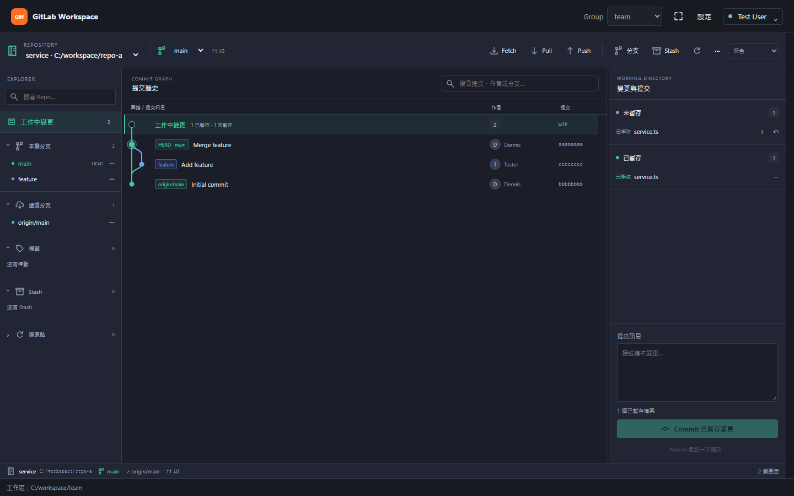

# Git GUI 更新修正與 GitKraken 風格改版

實作日期：2026-10-08。改動保留 Preact、繁體中文與既有 Git 操作確認，主題及版面樣式限定於版控區域。

## 更新與指令量

背景快照及事件回應不再呼叫 `status()`，移除依畫面 revision 不同而反覆重跑的路徑。首次開啟、手動重新整理及必要寫入流程才明確更新狀態，操作結束共用同一份快照。VS Code 的 `state.onDidChange` 表示 status 已完成；它本身不能證明內容改變。[VS Code Git API 原始碼](https://github.com/microsoft/vscode/blob/main/extensions/git/src/api/api1.ts#L34-L40)

每個 Repo 的背景事件以 250ms 合併，最長等待 1 秒；工作進行中收到事件只保留一次補更新。失敗不自行重試。離開版控、隱藏或關閉工作台時取消計時器及尚未開始的讀取，已接受的寫入正常完成；重新顯示時合併更新一次。共用 Git 目錄的 worktree 仍使用同一把操作鎖。

內容指紋以 native Git state、本機修改檔案與 Git metadata 判斷真正的變更，不執行 Git 指令。暫存區指紋忽略 status 可能改寫的 stat／效能快取，保留路徑、mode、object ID、衝突 stage 及 sparse／intent-to-add 旗標。支援 index v2／v3／v4 和 SHA-256；未知必要擴充或 split index 採保守失效，避免隱藏變更。[Git index 格式](https://git-scm.com/docs/gitformat-index)

Repo 摘要、分支、Stash、歷史分頁與不可變的提交內容共用快取。資料變更 epoch 與畫面 revision 分開；相同選取共用讀取，過期的排隊選取直接略過。跨 Repo 返回時會建立新開啟請求，避免共用前一次生命週期已取消的工作。`readDiff`、`readCommit`、`history` 及不帶 Fetch 的 Rebase 預覽共用讀取分類。

核心實作：[更新排程](../../../src/git/gitRefreshScheduler.ts)、[狀態指紋](../../../src/git/gitStateFingerprint.ts)、[Repo 服務](../../../src/git/gitRepositoryService.ts)。

## Git GUI

- 頂端提供 Repo、目前分支、同步數量、Fetch／Pull／Push、建立分支與 Stash，其他操作收於進階選單。
- 左側分組顯示本機／遠端分支、標籤、Stash 與復原點。點 Ref 讀取提交；Checkout、刪除、Merge、Rebase 使用明確選單。註解標籤與輕量標籤都連到實際提交。
- 中央使用真正的 parent 連線與彩色 lane，標示 HEAD、Ref 及工作中變更。初始與分頁歷史均採拓撲排序，保留虛擬捲動；搜尋高亮及定位，不移除圖上的其他提交。
- 點選檔案切換中央 Diff，可返回提交圖。保留部分行暫存、整檔操作、原生大型／二進位 Diff 入口及 Merge Parent 比較。切換 Parent 時等待對應資料，不顯示前一個 Parent 的檔案清單。
- 右側呈現衝突、未暫存、已暫存清單及 Commit／Amend 表單；歷史選取則顯示提交資訊、檔案與操作。
- 預設炭灰／青綠主題，也可跟隨 VS Code。左右欄預設 220／320px，可拖曳或用方向鍵調整；窄版改為側面板。

Repo 摘要的選用 `headCommit` 支援 Detached HEAD 與 WIP 連線；分支名稱以 symbolic HEAD 判定，避免原生 API 在 Detached HEAD 回傳標籤名稱時誤判為分支。圖上也保留 Detached HEAD 的明確 HEAD 標記。每個 Repo 保存草稿、提交、Parent 與檔案選取，並區分已暫存／未暫存檔案；遷移 v1 狀態。Commit 成功由後端明確回報，失敗或取消保留草稿，即使外部程序同時改變 HEAD 也不會誤清除。成功時僅清除本次送出的文字，保留操作途中輸入的新草稿。

提交圖計算為[可測試的純函式](../../../src/git/gitGraphLayout.ts)。操作說明已更新至[使用指南](../../user-guide.md)、[疑難排解](../../troubleshooting.md)與[貢獻指南](../../../CONTRIBUTING.md)。

## 驗證證據

完整 `npm test` 已通過，詳細摘要見 [npm-test.json](evidence/npm-test.json)。

| 檢查 | 結果 |
| --- | --- |
| TypeScript 單元測試 | 196 通過 |
| Webview 行為測試 | 33 通過 |
| Cucumber 行為情境 | 40 通過 |
| 發行、安裝及交付回歸 | 24 個 Node 測試、123 個 Python 測試通過 |
| VS Code Extension Host | 12 通過；2 個需要獨立驗證環境的情境略過 |
| VSIX／離線套件內容與 SHA256SUMS | 通過 |

新增回歸涵蓋 status 每次送出通知、無內容變更的通知、大量事件與更新途中事件、失敗／隱藏／關閉、排隊取消、A→B→A 共用讀取、暫存區／工作目錄 Diff、提交圖 parent／分頁、狀態遷移與草稿取消。上表略過的本機 Git GUI 情境由獨立的 `test:git-gui:local` 執行；真實 GitLab 連線不屬於本機驗證範圍。

[版面驗證紀錄](evidence/visual-validation.json)使用實際建置的 Webview 與隔離訊息橋接，檢查深色、跟隨 VS Code 的淺色、高對比及 600px 窄版。截圖已人工檢視，未發現外層水平溢出或瀏覽器錯誤。

其他畫面：[Diff](evidence/screenshots/git-diff-dark.png)、[淺色](evidence/screenshots/git-graph-light.png)、[高對比](evidence/screenshots/git-graph-high-contrast.png)、[窄版圖](evidence/screenshots/git-narrow-graph.png)、[窄版變更面板](evidence/screenshots/git-narrow-changes.png)。

本機整合驗證使用產生的 seed、獨立 bare remote 與 VS Code 設定檔，操作打包後的真實 Webview。Commit／Push 等原生確認由 Extension Host 測試處理器回答；不將原生確認視窗的版面或真實 GitLab 遠端連線計入此驗收。

本環境的已安裝 VS Code 1.141.0 因安裝目錄讀取權限檢查而無法在受限程序啟動，驗證改用工作區內 `.vscode-test/vscode-1.141.0-isolated/Code.exe` 的隔離副本及專用設定檔；沒有關閉 Electron sandbox。驗證完成後已清理此隔離副本。可用 `VSCODE_EXECUTABLE_PATH` 指定可執行的本機安裝，重跑命令見貢獻指南。

## 本機 GUI 與交付結果

最終本機 GUI 驗收通過，詳見 [git-gui-local.json](evidence/git-gui-local.json) 與 [整體驗證紀錄](evidence/verification.json)。已執行 `npm run test:git-gui:local`；最後一次使用完整 `npm test` 產生的同一份 VSIX，直接執行相同的本機 GUI runner，避免其餘發行測試進行中重建安裝包。

| 閒置前操作 | 實測閒置時間 | 擴充功能 Git 指令 | 輔助 Git 指令 | Native Git API 呼叫 | VS Code 自發 Git 指令 |
| --- | --- | --- | --- | --- | --- |
| 開啟 | 60.008 秒 | 0 | 0 | 0 | 0 |
| 選取檔案 | 60.007 秒 | 0 | 0 | 0 | 0 |
| 暫存 | 60.011 秒 | 0 | 0 | 0 | 0 |
| 提交 | 62.358 秒 | 0 | 0 | 0 | 0 |

計數均為閒置期間的增量。相同檔案連點 20 次沒有新增讀取。另一次暫存閒置檢查曾收到原生 status 完成通知與 4 次 VS Code 背景指令，擴充功能仍為零新增活動，見 [原生通知實測](evidence/status-notification-idle.json)。

真實 GUI 操作驗證涵蓋部分行／整檔暫存與取消暫存、Commit、建立分支、Push／設定 upstream、Stash Apply／Pop／Drop、捨棄與復原、Fetch／Pull、互動式 Rebase 六種 todo 操作及暫停／繼續、Amend、Force-with-lease 競態拒絕、Merge Parent Diff、Revert／Cherry-pick，以及註解／輕量標籤、Tagged Detached HEAD、空 Repo 和快速 Repo 切換。原生確認由測試處理器回答，版面不計入驗收。

[真實 VS Code 截圖](evidence/screenshots/local-git-gui.png)。

交付：`dist/gitlab-workspace-0.13.2.vsix`，5,060,388 bytes。SHA-256：

    057fc01b0a588909b488c46729e2531e8d33233313be8d18853ac918024086be

此 SHA 與真實 GUI 測試載入的 VSIX、`dist/SHA256SUMS` 一致。使用說明與測試證據已更新；未發佈到遠端，也未安裝到使用者的 VS Code 設定檔。
